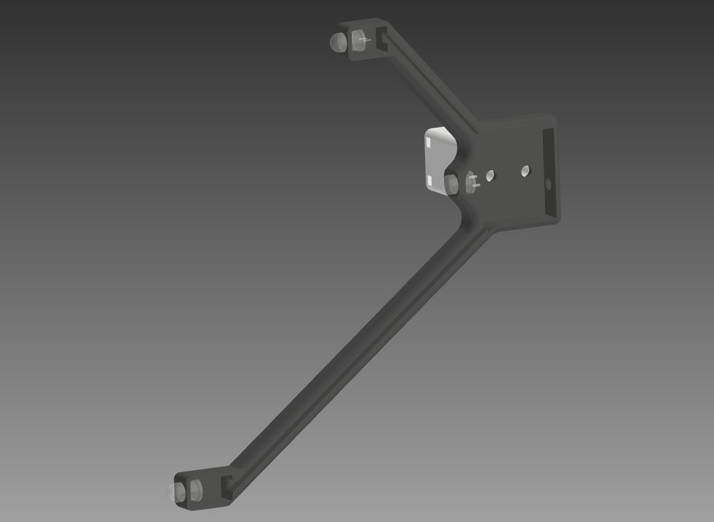
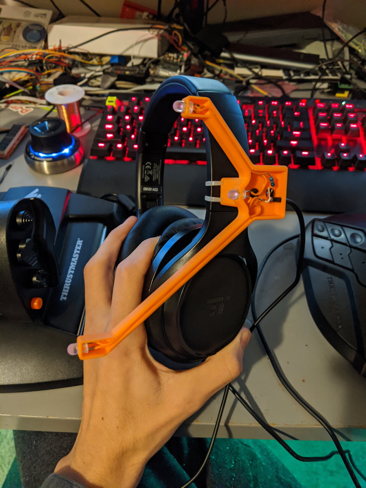

# IR-Headtracker-Clip
Cheap and not pain in the ass printable IR headtracker clip for PS3 eye freetrack use. 

**Parts list** 
* 3x IR LEDs 
* 1x each printed STL 
* 1x 10 ohm resistor
* 1x 3mm diameter usb/power cable
* 1mm wire (I used EBW initiator leadwire I had around)
* 2x 3x6mm bolts
* 2x small zip ties 

Solder the LEDs in series with the 10 ohm as a current limiting resistor, then push 1mm wire into slots, and solder to the USB/power leads
Then just bolt the riser on, and zip tie to one side of your headphones arms, then install and configure FreeTrack, defaults work just fine. 

